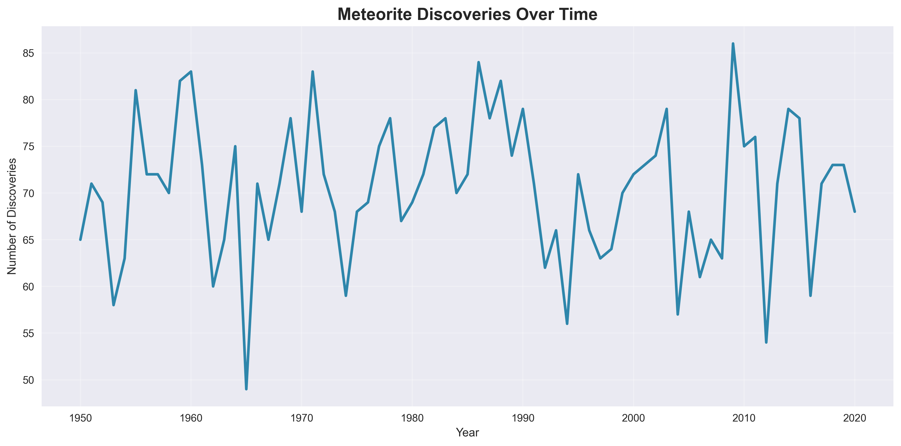
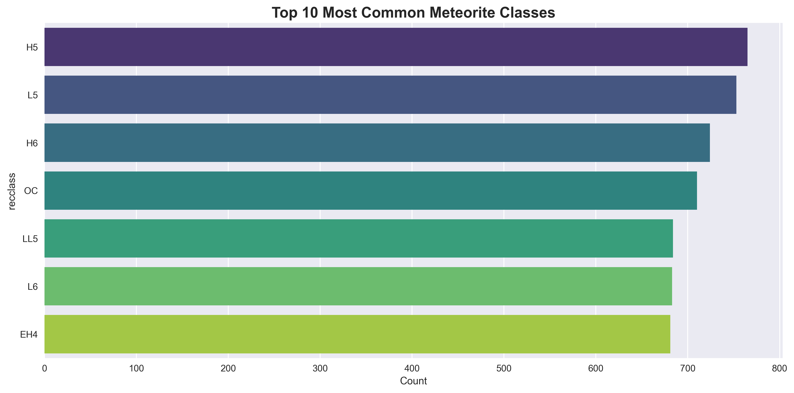
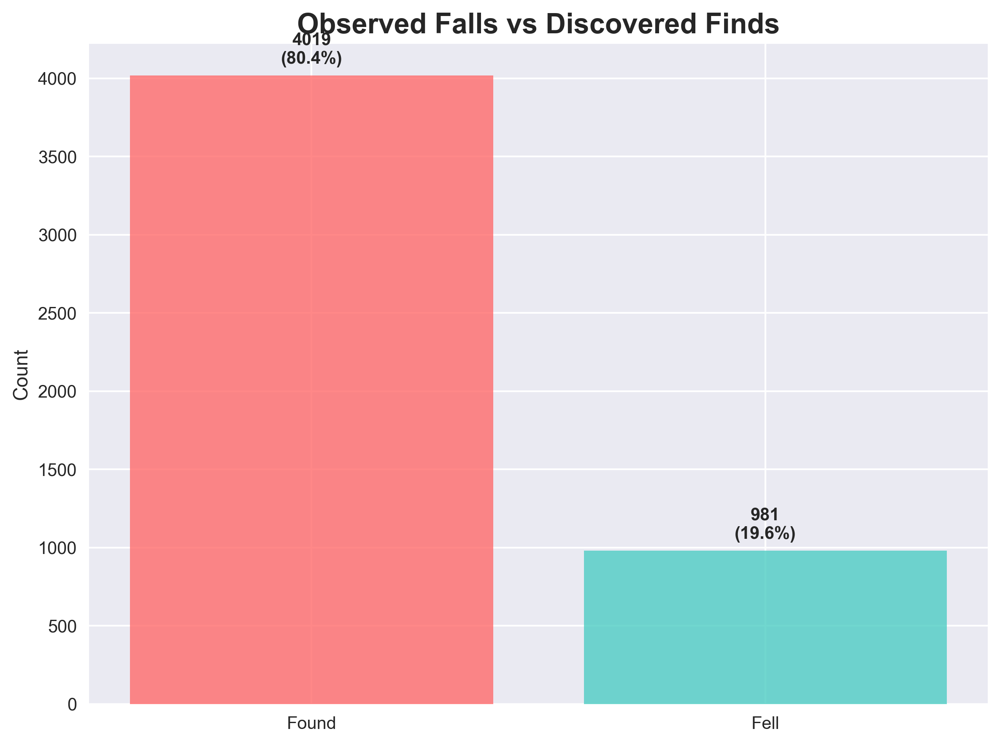
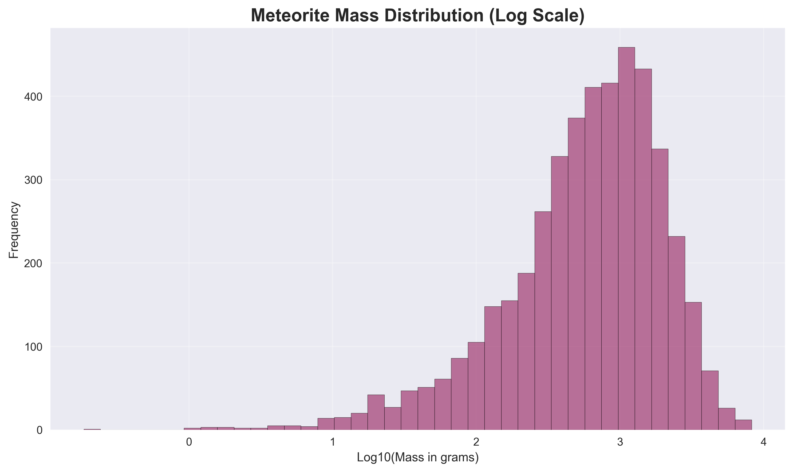
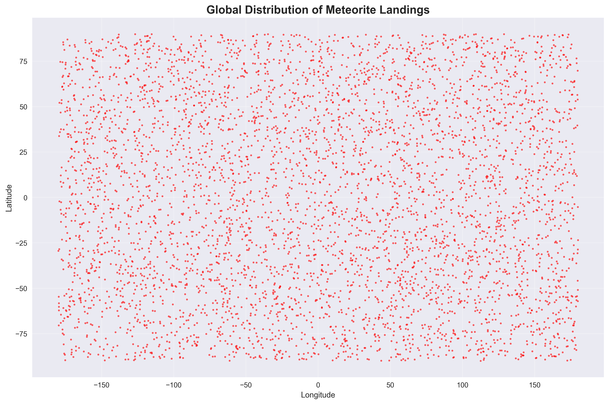
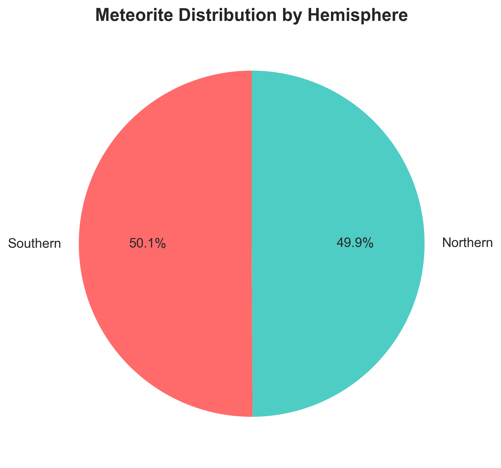
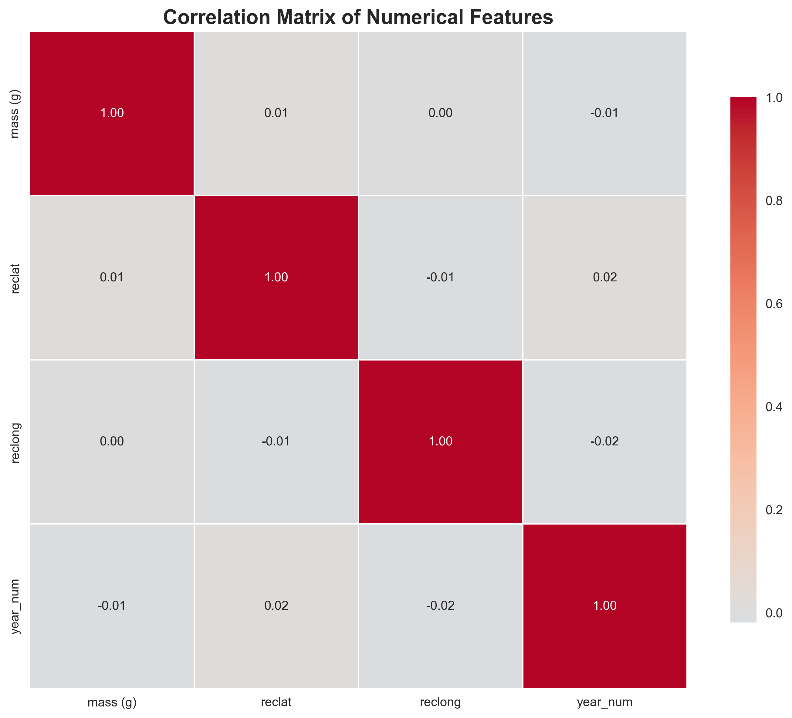
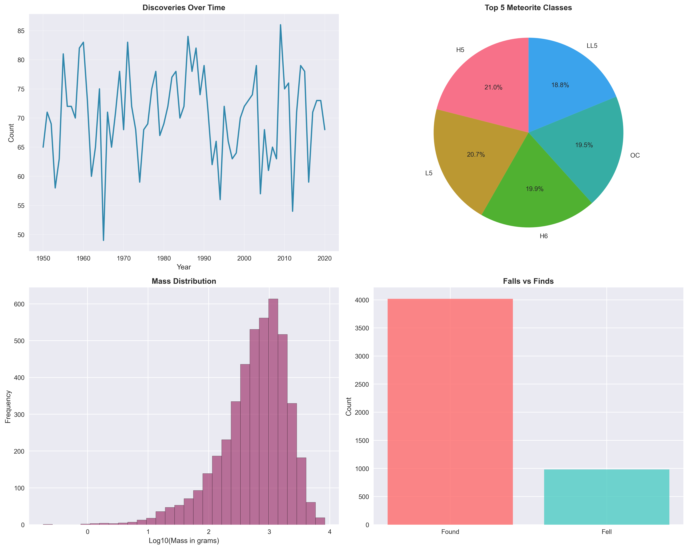

# Meteorite Landings Data Analysis

## Project Overview
This project analyzes a comprehensive dataset of meteorite landings through data cleaning, exploratory analysis, and visualization.

## 📊 Key Insights

### 1. Discovery Trends
- **Total Meteorites Analyzed**: {total_meteorites:,}
- **Temporal Coverage**: {int(valid_discoveries['year_fixed'].min())} to {int(valid_discoveries['year_fixed'].max())}
- **Peak Discovery Year**: {discoveries_per_year.idxmax()} with {discoveries_per_year.max()} discoveries

### 2. Meteorite Composition
- **Most Common Types**: {', '.join([f'{cls} ({count})' for cls, count in df_clean['recclass'].value_counts().head(3).items()])}
- **Observation Rate**: {observed_falls/total_meteorites*100:.1f}% observed falls vs {found_meteorites/total_meteorites*100:.1f}% discovered finds

### 3. Physical Characteristics
- **Average Mass**: {df_clean['mass (g)'].mean():.2f} grams
- **Median Mass**: {df_clean['mass (g)'].median():.2f} grams
- **Mass Range**: {df_clean['mass (g)'].min():.2f}g to {df_clean['mass (g)'].max():,.0f}g

### 4. Geographic Distribution
- **Northern Hemisphere**: {northern} ({northern/total_meteorites*100:.1f}%)
- **Southern Hemisphere**: {southern} ({southern/total_meteorites*100:.1f}%)

### 5. Feature Correlations

### 6. Combined Overview

## 🛠️ Technical Implementation

### Tools & Technologies
- **Python**: Pandas, NumPy, Matplotlib, Seaborn
- **Jupyter Notebook** for analysis
- **Git** for version control

### Project Structure
